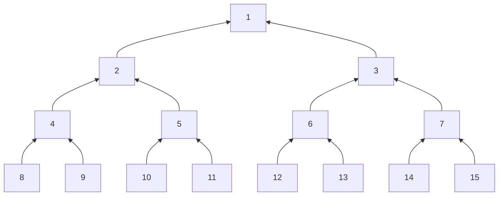
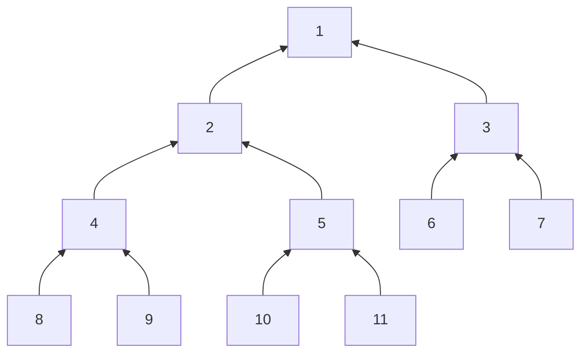

# 二叉树

二叉树是最常用的树形结构,特别适合程序设计,常常将一般的树转换成二叉树来处理.我们从二叉树的定义、遍历问题,以及二叉搜索树进行讲解.

## 二叉树的存储

### 二叉树的性质

二叉树的每个结点最多有两个子结点,分别是左孩子、右孩子,以它们为根的子树称为左子树、右子树.二叉树的第i层最多有２i－１个结点.如果每一层的结点数都是满的,称它为满二叉树.一个n层的满二叉树,结点数量一共有２n－１个,可以依次编号为１,２,３,,２n－１.如果满二叉树只在最后一层有缺失,并且缺失的编号都在最后,那么称为完全二叉树.满二叉树和完全二叉树图示如图所示.

#### 满二叉树：如果每一层的结点数都是满的,称它为满二叉树.



#### 完全二叉树：如果满二叉树只在最后一层有缺失,并且缺失的编号都在最后,那么称为完全二叉树.

完全二叉树非常容易操作.一棵结点数量为k的完全二叉树,设１号点为根结点,有以下性质:
(1) i＞１的结点,其父结点是i/２;
(2) 如果２i＞k,那么i没有孩子;如果２i＋１＞k,那么i没有右孩子;
(3) 如果结点i有孩子,那么它的左孩子是i,右孩子是i.



### 二叉树的存储结构

二叉树一般使用指针来实现,并指向左、右子结点.

```c++
struct node{
    int value;      //结点的值
    node *l,*r;     //指向左、右子结点
}
```

    在新建一个node时，用new运算符动态申请内存。使用完毕后,应该用delete释放它，否则会内存泄漏。
    二叉树也可以用数组来实现。特别是完全二叉树，用数组来表示父结点和子结点的关系非常简便。

## 二叉树的遍历

#### 宽度优先遍历

    有时需要按层次一层层地遍历二叉树，那么用宽度优先遍历最合适，用队列实现搜索的过程。

#### 深度优先遍历

    按照深度搜索的顺序访问二叉树，对根结点、左儿子、右儿子进行组合有以下三组情况：
    1、先序（根）遍历：中左右
    2、中序（根）遍历：左中右
    3、后序（根）遍历：左右中

先序遍历的第1个结点是根，代码如下：

```c++
void preorder(node *root){
    cout<<root -> value; //输出
    preorder(root -> l); //递归左子树
    preorder(root -> r); //递归右子树
}
```

### hdu1710 Binary Tree Traversals

[view the problem](https://vjudge.net/problem/HDU-1710)

    输入二叉树的先序和中序遍历序列，求后序遍历。
    (１)输入样例。
    先序:１２４７３５８９６
    中序:４７２１８５９３６
    (２)输出样例。
    后序:７４２８９５６３１

建树过程如下：
1、先序遍历的第１个数是整棵树的根,例如样例中的“１”.知道了“１”是根,对照中序遍历,“1”左边的“4 7 2”都在根的左子树上,右边的“8 5 9 3 6”都在根的右子树上.
2、递归上述过程.例如,上面步骤得到的中序遍历的“４７２”,对照先序的第２个数是“２”,那么“２”是左子树的根,在中序遍历的“４７２”中,“２”左边的“４７”都在以“２”为根的左子树上,等等.

代码如下，其中preorder()、inorder()、postorder()分别是先序遍历、中序遍历和后序遍历。用DFS实现比较容易。

```c++
#include<bits/stdc++.h>
using namespace std;
const int N=1010;
int k,pre[N],in[N],post[N];//先序 中序 后序
struct node{
    int value;
    node *l,*r;
    //定义构造函数，方便调用
    node(int value=0,node *l=NULL,node *r=NULL):value(value),l(l),r(r){};
};
//Build the tree，l起始, r结束, &t当前层级, *&root根节点
void buildtree(int l,int r,int &t,node *&root){
    int flag=-1;
    for(int i=l;i<=r;i++)
        //每次找到in和pre相等的值作为当前的根节点
        if(in[i]==pre[t]){
            flag=i;
            break;
        }
    if(flag==-1) return;
    root=new node(in[flag]);//新建根结点
    t++;//t做为层级
    if(flag>l) buildtree(l,flag-1,t,root->l);//root->l l作为根节点
    if(flag<r) buildtree(flag+1,r,t,root->r);//root->r r作为根节点
}
//Find the preorder sequence
void preorder(node *root){
    if(root!=NULL){
        post[k++]=root->value;
        preorder(root->l);
        preorder(root->r);
    }
}
//Find the inorder sequence
void inorder(node *root){
    if(root!=NULL){
        inorder(root->l);
        post[k++]=root->value;
        inorder(root->r);
    }
}
//Find the postorder sequence
void postorder(node *root){
    if(root!=NULL){
        postorder(root->l);
        postorder(root->r);
        post[k++]=root->value;
    }
}
//Free up space
void remove_tree(node *root){
    if(root==NULL) return;
    remove_tree(root->l);
    remove_tree(root->r);
    delete root;
}
int main(){
    int n;
    while(~scanf("%d",&n)){
        for(int i=1;i<=n;i++) scanf("%d",&pre[i]);//存入先序
        for(int i=1;i<=n;i++) scanf("%d",&in[i]);//存入中序
        node *root;//创建根结点,new运算符动态申请内存
        int t=1;
        buildtree(1,n,t,root);
        k=0;//记录结点个数
        postorder(root);
        for(int i=0;i<k;i++) printf("%d%c",post[i],i==k-1?'\n':' ');
        //作为验证，这里可以用preorder()和inorder()检查先序和中序遍历
        remove_tree(root);
    }
    return 0;
}
```

> 代码中的remove\_tree()释放申请的空间,如果不释放,会内存泄漏,造成内存浪费.释放空间是标准的、正确的操作.不过,竞赛题目的代码很少,即使不释放空间,也不会出错;而且程序终止后,它申请的空间也会被系统收回.

> 解析：建树的过程如下:(１)先序遍历的第１个数是整棵树的根,例如样例中的“１”.知道了“１”是根,对照中序遍历,“１”左边的“４７２”都在根的左子树上,右边的“８５９３６”都在根的右子树上.(２)递归上述过程.例如,上面步骤得到的中序遍历的“４７２”,对照先序的第２个数是“２”,那么“２”是左子树的根,在中序遍历的“４７２”中,“２”左边的“４７”都在以“２”为根的左子树上,等等.如图所示为示意图,画线的数字是读取先序遍历逐一处理的当前步骤的根,方框内是中序遍历的部分数字


